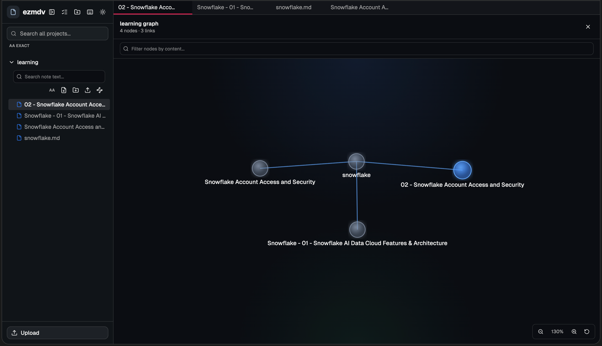
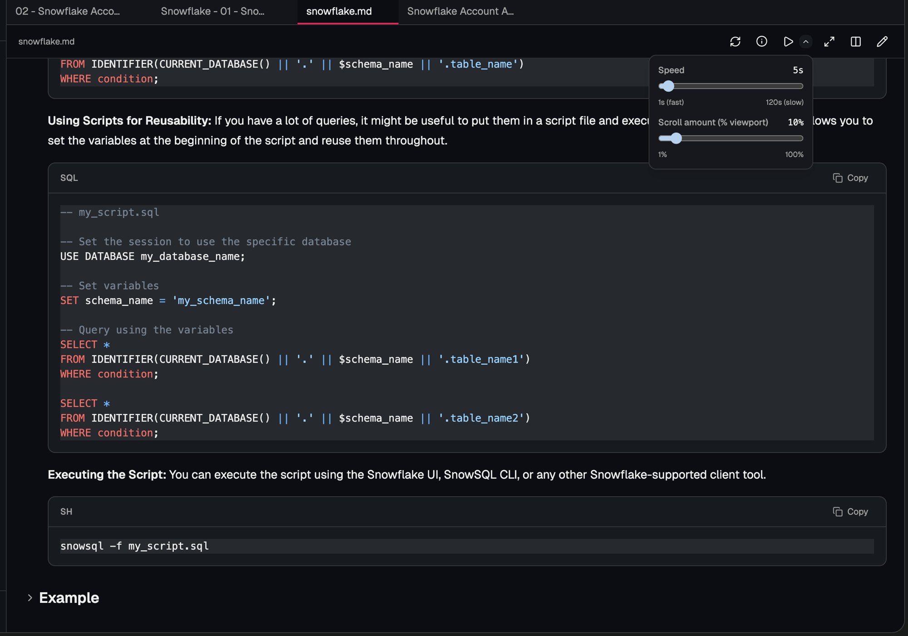

# ezmdv

Easy Markdown Viewer is a browser-based markdown viewer/editor launched from the CLI.

It is a monorepo with three packages:

- `packages/cli`: CLI entry point
- `packages/server`: Express API + WebSocket server
- `packages/web`: React SPA

## Screenshots





## Features

- Open a markdown project from the CLI or upload files directly in the browser
- Browse markdown files in a sidebar tree
- Create new `.md` files in-app with inline naming
- Preview rendered markdown with code highlighting, Mermaid diagrams, KaTeX math, footnotes, and collapsible sections
- Edit markdown in-app with CodeMirror 6 and save changes
- Obsidian-style `[[wiki-links]]` with autocomplete while editing
- Open two markdown files side by side for reading
- Fullscreen a markdown pane
- Interactive project graph with constellation visuals (glow, gradients, floating animation), smooth drag, link highlighting, and zoom/pan controls
- Graph node preview modal with minimize/maximize/restore controls
- Per-project and global search with exact and fuzzy modes (trigram + stemming)
- Refresh from disk button and keyboard shortcut (`Ctrl/Cmd+Shift+R`)
- Drag-and-drop `.md` files onto the app to upload
- Autoscroll (teleprompter mode) with configurable interval and scroll percentage
- Customizable keyboard shortcuts — remap any action from the shortcuts modal and changes persist across sessions
- Per-file zoom (50–200%) in all reading views — zoom level remembered per file across sessions
- Drag-and-drop projects onto each other to merge as subfolders (no confirmation dialog)
- Drag a **subfolder** from the file tree onto another project header to merge it into that project
- Drag a **subfolder** from the file tree to the drop zone below the project list to extract it as a new standalone project
- Create subfolders within projects directly from the file tree
- Multi-select projects for bulk delete/open
- File metadata tooltip (size, line count, dates)
- Light and dark theme
- Deleted CLI projects are remembered and not re-added on restart

## Quick Start

```bash
git clone https://github.com/bruno-rv/ezmdv.git
cd ezmdv
npm install
npm start
```

This builds everything and opens your browser to the repo root. For your own notes, pass a path instead:

```bash
ezmdv ~/notes
```

Click **Upload** in the sidebar to select `.md` files if you don't have a local folder to point at.

### Updating an existing clone

```bash
git pull
npm install
npm run build
```

Always run `git pull` before `npm install` — build scripts and dependencies may have changed.

## Requirements

- Node.js **v22+** (22 is the current LTS; earlier versions lack `import.meta.dirname`)
- npm 10+

## Build

Build all workspaces (server first, then CLI + web in parallel):

```bash
npm run build
```

## Usage

### Open a specific project

Point the CLI at a markdown file or directory:

```bash
node packages/cli/dist/index.js /path/to/markdown-or-folder
```

Options:

```bash
node packages/cli/dist/index.js /path/to/docs --port 3000 --no-open
```

### Link the CLI globally

```bash
npm run build
npm link ./packages/cli
ezmdv /path/to/markdown-or-folder
```

### Just open the browser and upload

If you don't have a local markdown folder to point at, you can launch ezmdv and upload files directly:

```bash
npm start
```

The browser opens automatically. Use the **Upload** button in the sidebar to select one or more `.md` files from anywhere on your machine.

## Development

Run the backend and frontend in separate terminals for hot-reload:

Terminal 1:

```bash
npm run dev:server
```

Terminal 2:

```bash
npm run dev:web
```

Open `http://localhost:5173` — changes hot-reload instantly via Vite HMR.

## Tests

162 tests across 16 files using Vitest:

```bash
npm test
```

- **Server** (97 tests, 6 files): state management, path traversal security, markdown graph/search, API routes, file creation, folder creation, project merging, subfolder extraction, subfolder merge, fuzzy search (trigrams, stemming, scoring)
- **Web** (65 tests, 10 files): wiki-links, pane workspace, edit mode, autoscroll, graph filtering, autocomplete, graph zoom, ExpandedProjectContent component, GlobalSearch component

## Local Data

ezmdv stores application data under `~/.ezmdv/`:

- `state.json`: projects, theme, open tabs, checkbox state, dismissed CLI paths, keyboard shortcut overrides
- `uploads/`: uploaded markdown projects
- `trash/`: soft-deleted uploads (auto-purged after 30 days)

## Notes

- All data stays on your machine — nothing is sent to external servers.
- The server only allows localhost origins.

## License

MIT. See [LICENSE](./LICENSE).
